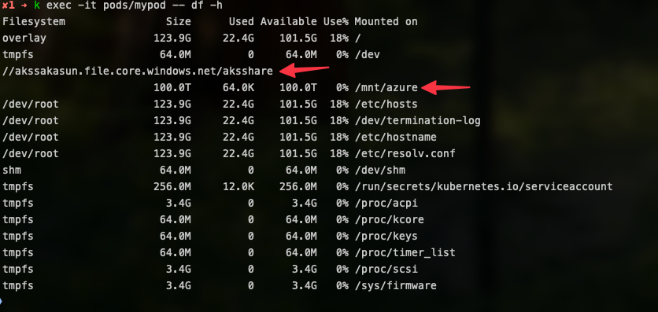
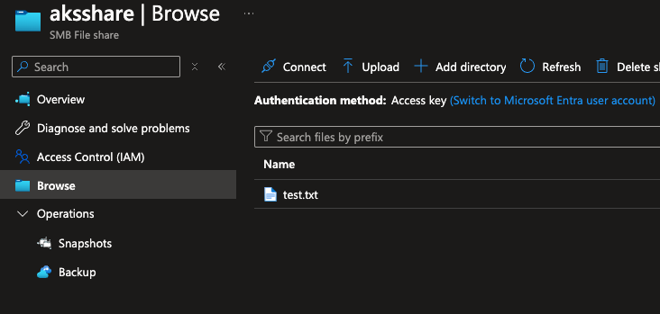

# Azure Storage Files Documentation

This documentation provides an overview of the files and their purposes within the `Azure-AKS-Training/AKS Storage/Azure Storage Files` directory.

## Table of Contents
- [Azure Storage Files Documentation](#azure-storage-files-documentation)
  - [Table of Contents](#table-of-contents)
  - [Introduction](#introduction)
  - [Files Overview](#files-overview)
  - [Steps by Step Guide](#steps-by-step-guide)
  - [References](#references)

## Introduction
This directory contains resources and scripts related to Azure Storage Files, which are used in conjunction with Azure Kubernetes Service (AKS) for managing storage needs. In this demo we will create a storage account, a file share, and a persistent volume in AKS using Azure Storage Files. Azure provide the capability of dynamical creating storage accounts and file shares in AKS.

## Files Overview
Below is a list of the files in this directory and their descriptions:

- **README.md**: README for the section.
- **Azure-files.azcli**: Commands required for the Demo.


## Steps by Step Guide

1. Export the following environment variables:

    ```bash
    export RESOURCE_GROUP=aks-training-demo
    export AKS_CLUSTER_NAME=aks-training-demo-01
    export LOCATION=northeurope
    export STORAGE_ACCOUNT_NAME=akssakasun
    ```

2. Create Resource Group

    ```bash
    az group create --name $RESOURCE_GROUP --location $LOCATION
    ```

3. Create Storage Account

    ```bash
    az storage account create --name $STORAGE_ACCOUNT_NAME --resource-group $RESOURCE_GROUP --location $LOCATION --sku Standard_LRS
    ```

4. Create AKS Cluster

    ```bash
    az aks create --resource-group $RESOURCE_GROUP --name $AKS_CLUSTER_NAME --node-count 1 --generate-ssh-keys
    ```

5. Get AKS Credentials

    ```bash
    az aks get-credentials --resource-group $RESOURCE_GROUP --name $AKS_CLUSTER_NAME
    ```

6. Create a Storage Account 
  
    ```bash
    az storage account create --name $STORAGE_ACCOUNT_NAME --resource-group $RESOURCE_GROUP --location $LOCATION --sku Standard_LRS
    ```

7. Get the Storage Account Connection String
  
    ```bash
    export AZURE_STORAGE_CONNECTION_STRING=$(az storage account show-connection-string -n $STORAGE_ACCOUNT_NAME -g $RESOURCE_GROUP --query connectionString -o tsv)
    ```

8. Create a Storage Account File Share

    ```bash
    az storage share create --name $STORAGE_ACCOUNT_NAME --connection-string $AZURE_STORAGE_CONNECTION_STRING
    ```

9. Get the Storage Account Key

    ```bash
    export AZURE_STORAGE_KEY=$(az storage account keys list --resource-group $RESOURCE_GROUP --account-name $STORAGE_ACCOUNT_NAME --query "[0].value" -o tsv)
    ```

10. Create a Kubernetes Secret

    ```bash
    kubectl create secret generic azure-secret --from-literal=azurestorageaccountname=$STORAGE_ACCOUNT_NAME --from-literal=azurestorageaccountkey=$AZURE_STORAGE_KEY
    ```

11. Get the Storage Account File Share ID

    ```bash
    export SA_SHARE_ID=$(az storage share-rm show -g $RESOURCE_GROUP --storage-account akssakasun --name aksshare -o tsv --query id)
    ```

12. Crate a Persistent Volume

    ```bash
    kubectl apply -f - <<EOF
    apiVersion: v1
    kind: PersistentVolume
    metadata:
      annotations:
        pv.kubernetes.io/provisioned-by: file.csi.azure.com
      name: azurefile
    spec:
      capacity:
        storage: 5Gi
      accessModes:
        - ReadWriteMany
      persistentVolumeReclaimPolicy: Retain
      storageClassName: azurefile-csi
      csi:
        driver: file.csi.azure.com
        volumeHandle: "$SA_SHARE_ID"
        volumeAttributes:
          shareName: aksshare
        nodeStageSecretRef:
          name: azure-secret
          namespace: default
      mountOptions:
        - dir_mode=0777
        - file_mode=0777
        - uid=0
        - gid=0
        - mfsymlinks
        - cache=strict
        - nosharesock
        - nobrl  
    EOF
    ```

13. Create a Persistent Volume Claim

    ```bash
    kubectl apply -f - <<EOF
    apiVersion: v1
    kind: PersistentVolumeClaim
    metadata:
      name: azurefile
    spec:
      accessModes:
        - ReadWriteMany
      storageClassName: azurefile-csi
      volumeName: azurefile
      resources:
        requests:
          storage: 5Gi
    EOF
    ```

14. Create a Pod

    ```bash
    kubectl apply -f - <<EOF
    kind: Pod
    apiVersion: v1
    metadata:
      name: mypod
    spec:
      containers:
        - name: mypod
          image: mcr.microsoft.com/oss/nginx/nginx:1.15.5-alpine
          resources:
            requests:
              cpu: 100m
              memory: 128Mi
            limits:
              cpu: 250m
              memory: 256Mi
          volumeMounts:
            - mountPath: /mnt/azure
              name: volume
              readOnly: false
      volumes:
      - name: volume
        persistentVolumeClaim:
          claimName: azurefile
    EOF
    ```

15. Check the Pod

    ```bash
    kubectl get pod mypod
    #create a file in the pod
    kubectl exec -it mypod -- touch /mnt/azure/test.txt
    #check the file in the share
    az storage file list --account-name $STORAGE_ACCOUNT_NAME --share-name aksshare
    ```

Verify the mount is created successfully by viewing the pod mounts.

```bash
kubectl exec -it mypod -- df -h
```


After that you can see the file in the share in the Azure Portal.



## References
For more information on Azure Storage Files and AKS, refer to the following resources:
- [Azure Storage Files Documentation](https://docs.microsoft.com/en-us/azure/storage/files/)
- [Azure Kubernetes Service Documentation](https://docs.microsoft.com/en-us/azure/aks/)
